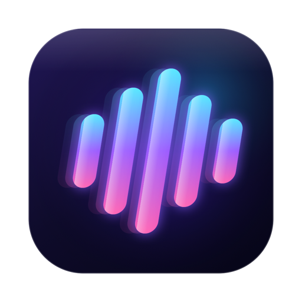
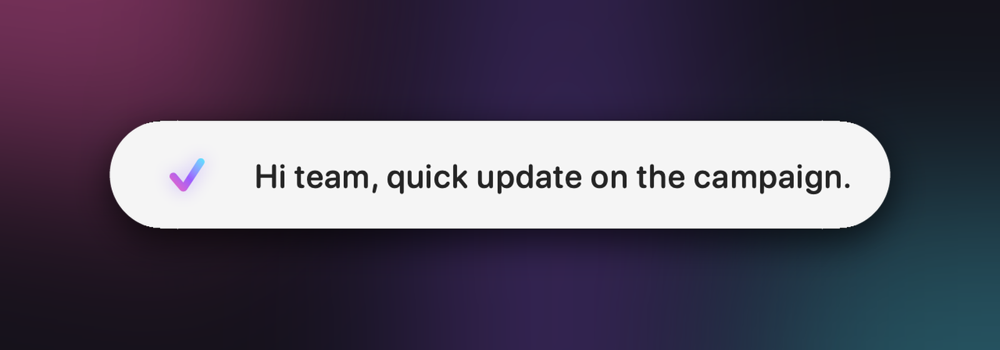
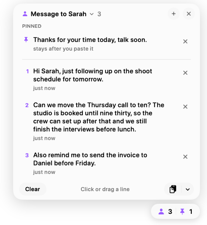

<p align="center">
  
</p>

<h1 align="center">Driftflow</h1>

<p align="center">
  <strong>Private, instant dictation for Mac and Windows.</strong><br>
  Hold a key, speak, and let go. Your words appear wherever you're typing, transcribed entirely on your computer.
</p>

<p align="center">
  <a href="https://github.com/10vr/driftflow/releases/latest"></a>
  
  <a href="LICENSE"></a>
</p>

<p align="center">
  <a href="#download">Download</a> ·
  <a href="#features">Features</a> ·
  <a href="#the-stack">The Stack</a> ·
  <a href="#privacy">Privacy</a> ·
  <a href="#building-from-source">Build from source</a>
</p>

<p align="center">
  
</p>

## Features

- **Works in every app.** Mail, Slack, your code editor, a browser form: if it takes text, Driftflow can type into it.
- **Fast.** Text appears as you speak, and the final text is inserted in about 60 ms after you let go (measured on Mac).
- **Accurate.** Driftflow uses NVIDIA's Parakeet speech models. On Mac, Parakeet Unified gets 2.55% of words wrong on the LibriSpeech benchmark, against 3.30% for Apple's own speech model.
- **Private by design.** Speech is transcribed on your own computer. No accounts, no analytics, no cloud processing.
- **Hold or tap.** Hold the key while you speak, or tap it once to keep listening hands-free until you tap again. Esc cancels.
- **A live preview.** A small floating pill shows a waveform and your words as they're recognised.
- **Your vocabulary.** Add names, product terms and jargon so they're spelled your way every time.
- **Clean text.** Filler words such as "um" and "uh" are removed automatically.
- **History.** Every dictation is kept on your computer for 30 days (adjustable), searchable and easy to copy.
- **Updates itself.** New versions download quietly and install when you quit the app.

Mac-only for now:

- **The Stack.** Dictate now, paste later. Dictations wait in a small stack at the corner of your screen until you click or drag them where they belong, and nothing is lost when there's no text box to type into. [More below](#the-stack).
- **AI Styles.** Apple's on-device model can tidy your dictation into Clean, Professional or Casual writing, with per-app and per-website rules (macOS 26 with Apple Intelligence).
- **Edit by voice.** Select text, press ⌃⌥E and say what to change: "make this shorter", "turn this into bullet points" (macOS 26 with Apple Intelligence).
- **Voice commands and snippets.** "New line", "new paragraph", "scratch that", and saved text you insert by saying a phrase.
- **Transcribe files.** Drop in audio or video and export text, timestamps, SRT or VTT subtitles.

## The Stack

Sometimes you want to say something before you know where it goes, or you've clicked away and there's nowhere to type. The Stack (Mac) holds those dictations for you.

<p align="center">
  
</p>

- **Send a dictation to the stack.** Hold **Right ⌘ + ⌃** while you speak (you can pick another key in Settings › Shortcuts), or click the stack button on the pill.
- **Never lose one.** If there's no text box where you're dictating, the text goes into the stack instead of disappearing.
- **Stack Mode.** Click the stack's tab to collect every dictation in a row, then paste them together.
- **Use them anywhere.** Point at the tab to open it. Click a line to paste it where your cursor is, drag it into any app, or drag the tab to drop the whole stack at once.
- **Pin what you reuse.** Pinned lines stay after you paste them, at the top of every stack (up to 5).
- **Keep several stacks.** Name them, give each an icon, and switch between them. On the Stacks page, drag lines from one stack to another.
- **Your limits.** A stack holds 20 lines by default (up to 200 in Settings). Stacks are kept as long as your History is, counted from their last change; pinned lines are kept until you remove them.

## Download

Get the latest version from the **[Releases page](https://github.com/10vr/driftflow/releases/latest)**.

| Platform | Requirements | Download |
|---|---|---|
| **Mac** | Apple Silicon (M1 or later), macOS 15 or later. AI Styles need macOS 26 with Apple Intelligence. | `Driftflow-<version>-macOS.dmg` |
| **Windows** | Windows 10 or 11, 64-bit. Uses the graphics card when it can (Vulkan) and the processor otherwise. | `Driftflow-<version>-Windows-x64-setup.exe` |

**Mac:** open the disk image and drag Driftflow onto the Applications folder. The first time you open it, right-click Driftflow in Applications and choose **Open**, because the app isn't signed with an Apple Developer ID yet.

**Windows:** run the installer. If Windows shows "Windows protected your PC", click **More info › Run anyway**, because the installer isn't code-signed yet.

On first launch, a short setup asks for microphone access (and, on Mac, Accessibility access so Driftflow can type into other apps), then downloads the speech model once (600–700 MB). After that, dictation works offline.

## How to use it

| | Mac | Windows |
|---|---|---|
| Dictate | Hold **Right ⌘**, speak, release | Hold **Right Alt**, speak, release |
| Hands-free | Tap **Right ⌘** once, tap again to finish | Tap **Right Alt** once, tap again to finish |
| Cancel | **Esc** | **Esc** |
| Into the stack | Hold **Right ⌘ + ⌃**, speak, release | |
| Settings | Menu bar icon › Settings… | System tray icon › Settings… |

You can choose a different key in Settings › Shortcuts. On keyboards where Right Alt types accented letters (AltGr), choose Right Ctrl.

## Privacy

- Your voice is transcribed on your computer and is never uploaded.
- Driftflow connects to the internet for only two things: downloading speech models (from Hugging Face, with a mirror as a fallback on Windows) and checking for updates (from this GitHub repository).
- Audio isn't stored. The one exception is a dictation that fails: its recording is kept for a day so you can retry it from History, then deleted.
- History and your stacks stay on your computer, and you can shorten how long they're kept or turn it off.
- There are no accounts, analytics or ads.

## Performance

Measured on a Mac with an M5 chip, running macOS 26.6:

| | Driftflow for Mac |
|---|---|
| First words on screen | 0.38–0.55 s after you start speaking |
| Text inserted after you let go | about 60 ms (short dictation), about 150 ms (90-second dictation) |
| Word error rate | 2.55% on 300 LibriSpeech recordings (5,603 words) |

Long dictations are transcribed in segments while you speak, so finishing a long one is nearly as quick as a short one. Details and model comparisons are in [`macos/README.md`](macos/README.md).

## Speech models

| Model | Languages | Mac | Windows |
|---|---|---|---|
| **Parakeet Unified 0.6B** (default) | English | ✓ | ✓ |
| Parakeet TDT v3 | English and 24 European languages | ✓ | ✓ |
| Parakeet TDT v2 | English | ✓ | ✓ |
| Whisper Large v3 Turbo | About 100 languages | | ✓ |
| Apple Speech | 50+ languages | ✓ | |

Change the model and language in Settings › Models.

## Building from source

Driftflow is two native apps that share a design and behaviour, not code. Each has its own folder and build instructions:

| App | Folder | Built with | Instructions |
|---|---|---|---|
| Mac | [`macos/`](macos/) | Swift, SwiftUI and AppKit; Parakeet on the Neural Engine via [FluidAudio](https://github.com/FluidInference/FluidAudio) | [`macos/README.md`](macos/README.md) |
| Windows | [`windows/`](windows/) | Rust and [Tauri](https://tauri.app), with a React interface; Parakeet on the graphics card via transcribe.cpp | [`windows/README.md`](windows/README.md) |

Quick start:

```bash
# Mac (needs the Xcode Command Line Tools)
cd macos && ./build.sh --install

# Windows (needs Rust, Bun and the Vulkan SDK; see windows/BUILD.md)
cd windows && bun install && bun run tauri dev
```

### Releasing

`macos/release.sh <version> --notes "What changed"` publishes both apps on one release page: it tags the version (GitHub then builds and signs the Windows installer), and builds, signs and uploads the Mac app. Installed copies update themselves. In the notes, start a line with `Mac:` or `Windows:` when it applies to one app only; each app is only offered updates with changes for it. See [`macos/README.md`](macos/README.md#releasing-and-auto-updates).

## Acknowledgements

Driftflow builds on excellent open-source work:

- [Handy](https://github.com/cjpais/Handy) by CJ Pais, the starting point of the Windows app (MIT licence; see [`windows/UPSTREAM.md`](windows/UPSTREAM.md)).
- [NVIDIA Parakeet](https://huggingface.co/nvidia) speech models.
- [FluidAudio](https://github.com/FluidInference/FluidAudio) for Parakeet on Apple's Neural Engine.
- [transcribe.cpp](https://github.com/handy-computer/transcribe.cpp) and [ggml](https://github.com/ggml-org/ggml) for speech recognition on Windows.
- [Sparkle](https://sparkle-project.org) and [Tauri](https://tauri.app) for updates.

## License

Driftflow is free software, licensed under the [GNU General Public License v3.0](LICENSE). You're free to use, study, change and share it; copies you distribute, changed or not, must stay under the same licence and include their source code. The Windows app includes code from Handy under the MIT licence, whose notice is kept in [`windows/LICENSE-HANDY`](windows/LICENSE-HANDY).
